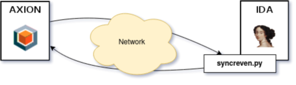

## Introduction

Axion is the main application of the [Reven platform](https://www.tetrane.com/demos.html), which captures a time slice of a full system execution.

It can then be connected to many tools, including [IDA Pro](https://hex-rays.com/ida-pro/), for the analysis. A plugin to synchronize the IDA view from inside Reven already exists, but there is no plugin for the reverse direction yet.

Thus, the SyncReven plugin for IDA has been developed in order to reach two goals:

- synchronize the Axion current analysis window with some code opened in IDA;
- discover the Python API available for extending the IDA GUI features.

The aim of the plugin is to quickly target the currently running code for a given position (dynamic view), which can at first hold encrypted data for instance (static view).

As a side effect, browsing code inside IDA can also provide some kind of code coverage because the number of captures is displayed for each of the browsed instructions.

## Installation process

The Reven Python bindings can be transposed from an original Reven system (Debian Buster) to a more recent user environment (Debian Bullseye).

The packages are stored in the installation directory. Some renaming tricks are mandatory to get wheels with compatible ABI, considering that:

- the `m` flag for pymalloc [became useless](https://docs.python.org/3/whatsnew/3.8.html#build-and-c-api-changes) since Python 3.8;
- the command [pip3 debug --verbose](https://pip.pypa.io/en/stable/cli/pip_debug/) provides all compatible tags.

```
scp -r user@server:/opt/reven-2.8.1-professional-mecha-buster/packages .

cp packages/reven2-2.8.1-py2.py3-none-any.whl .
cp packages/reven_api-2.8.1-cp37-cp37m-linux_x86_64.whl reven_api-2.8.1-cp39-none-linux_x86_64.whl
```

A virtual environment is not mandatory, but it offers a clean isolated setup:

```
apt-get install python3-venv

python3 -m venv py4reven

source py4reven/bin/activate

pip3 install reven2-2.8.1-py2.py3-none-any.whl reven_api-2.8.1-cp39-none-linux_x86_64.whl
```

Some extra dependencies and tricks may be needed:

```
apt-get install libboost-python1.74.0

ln -s /usr/lib/x86_64-linux-gnu/libboost_python39.so.1.74.0 /usr/lib/x86_64-linux-gnu/libboost_python37.so.1.67.0

apt-get install libboost-date-time1.74.0

ln -s /usr/lib/x86_64-linux-gnu/libboost_date_time.so.{1.74.0,1.67.0}
```

Finally, the `syncreven.py` script has to be put inside IDA's `plugins` directory.

## Workflow

The SyncReven plugin is composed of three parts:

- the `TransitionsPanel` class inherits `idaapi.PluginForm` : it extends IDA with a graphical panel and sends a transition to be displayed by Reven when needed;
- the `NavTracker` inherits `idaapi.UI_Hooks` and changes according to the current effective address;
- the `SyncWithReven` inherits `idaapi.plugin_t`: it is built from the `PLUGIN_ENTRY` entrypoint and leads all the previous classes.



At the beginning, the cursor inside IDA changes. A request is sent to REVEN to get an [iterator over all the transitions](https://doc.tetrane.com/professional/2.8.1/python-doc/reven2.search.Search.html#pc) for the current position:

```
found = self._server.trace.search.pc(new_ea)
```

On user request, a transition ID is later used to [force the relative view](https://doc.tetrane.com/professional/2.8.1/python-doc/reven2.session.Sessions.html#publish_transition) inside Axion:

```
trans = self._server.trace.transition(tid)

ret = self._server.sessions.publish_transition(trans)
```

## Simple example

The virtual environment providing the Python bindings has to be activated:

```
$ source py4reven/bin/activate
(py4reven) $
```

A project can then be opened in IDA from the same shell prompt. The message `Starting syncreven` should appear in the Output window.

A empty panel expects configuration parameters before displaying available Reven transition identifiers for the current IDA cursor:


IP address and listening port can be retrieved from the Reven target scenario (analysis tab) :


Activating the `Connect` button should print the following message in the Output window :

```
Reven server on ZZZZZZ (xx.xx.xx.xx:yyyy) [connected]
```

The plugin is now connected to the server, but Axion also has to be configured for a running session, which can be assigned using a combo box at the top of the Axion window:


Axion can then get fully notified by IDA.

Back to the IDA window, each time the current effective address changes, the transitions panel is updated.

Let's try with a small simple loop, which is run four times:


Once an instruction from the loop is selected, its four relative transition identifiers are displayed:


Double-clicking on one transition moves the Axion view to the selected captured transition relative to the current IDA view.
